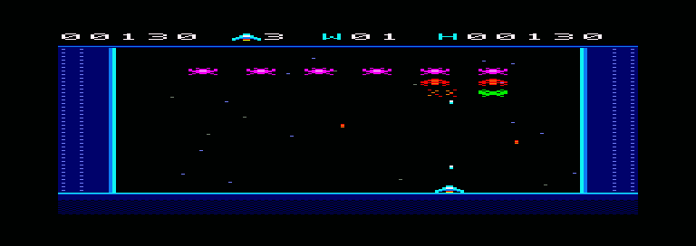
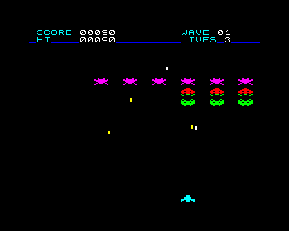
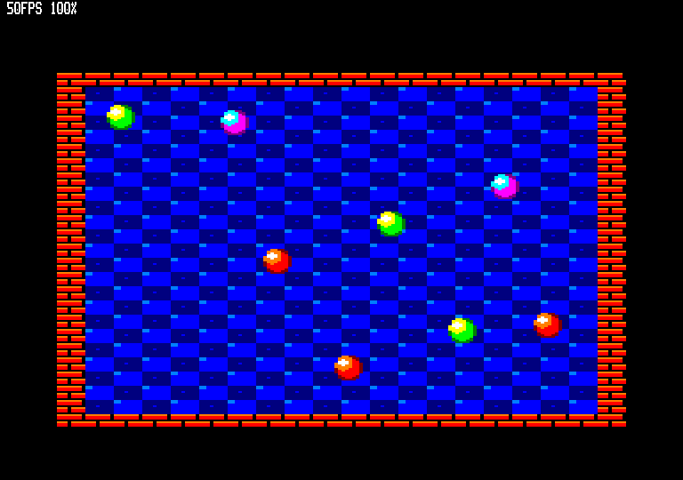

# CPCBuild

CPCBuild is an Amstrad CPC toolchain built on Boriel BASIC — a `--arch cpc` compiler backend (in the zxbasic fork, branch `cpc-arch`) plus the `cpcbuild` platform library, asset tools and test tooling. It is modelled on the Spectrum Next's NextBuild.

## Status

**Done:**
- Compiler backend: `--arch cpc` in the zxbasic fork (Phases 0-3: bootstrap, firmware gate, integers, floats, strings, arrays, DATA/READ).
- Text, input and graphics: PRINT/INK/PAPER/BORDER, INKEY$/INPUT, PLOT/DRAW/CIRCLE (4a); UDGs, fonts and SCREEN$ (4b).
- The `cpcbuild` library: screen addressing, double buffering, sprites (plain and masked), tiles and tile maps, fills, keyboard matrix scan, palettes. Written clean-room, MIT (4c).
- Asset pipeline: `img2cpc.py`, `tmx2bas.py` (4c).
- Interrupts always on through our own &0038 handler, firmware sound without blocking, AY register access, the Play library (4d).
- A headless reference emulator on floooh/chips that runs the whole test suite (pre-5a).

**Done:** Phase 5a — tests, CI, documentation. Phase 5b — music player (Arkos Tracker 3.7), sound effects, opt-in game mode. Phase 5c — single-screen shooter (Starfall) for CPC 6128/464 and Spectrum 128K/48K, cross-platform build machinery.  Phase 6 — bare-metal mode (no firmware), Starfall bare builds.

**Phase 6 (bare-metal mode):** `-D CPC_BAREMETAL` builds a program that never calls the firmware: the runtime boots the machine itself and does its own text, keyboard, sound and graphics, pixel-identical to firmware mode, with 6656 bytes more room for code and data (up to &B7FF). It also starts from a cold machine (no firmware), rehearsed by chipsrun's `--cold` mode as a step towards cartridges. The conformance and screenshot suites pass bare on chips (464, 6128; disc and cold start) and Caprice32 (464, 664, 6128), and run in CI (`make test-bare`). Starfall builds both ways from the same source: `RUN"DISC` starts the firmware builds, `RUN"BARE` the bare ones, at the same 25.0 steps/s. See the compiler's [Bare-metal mode](https://github.com/carcharo/zxbasic/blob/cpc-arch/docs/architectures/amstrad_cpc.md#bare-metal-mode) section.

**Supported models:** Amstrad CPC 464, 664, 6128. The runtime is firmware-first (text, graphics, sound and files go through the jumpblock at &BB00-&BDxx); the `cpcbuild` library drives the screen, keyboard and palette directly for speed. Phase 6 adds firmware-free bare-metal mode. CPC Plus features are planned for Phase 7.

## Screenshots

**Starfall (Phase 5c):** a single-screen shooter for CPC and Spectrum.




See [games/shooter/README.md](games/shooter/README.md) for how to play and build all four versions (CPC 6128/464, Spectrum 128K/48K).

**bounce.bas demo:** A tiled background (8×8 mode-0 tiles, 16-colour palette) with eight masked sprites bouncing, double-buffered at 25 updates per second (a new frame every other 50 Hz screen refresh).



Build the demo yourself: `make run PROG=examples/bounce.bas`

## Quick start

### Prerequisites

- macOS dev environment
- Python 3 + Pillow (`pip install Pillow`)
- Poetry (`pipx install poetry` or Homebrew)
- zxbasic fork checked out as `../zxbasic` on branch `cpc-arch` with `poetry install`
- Caprice32 built from source in `../caprice32` (needs SDL2, `brew install sdl2`; used for `make run` and `make test`)
- A C compiler for chipsrun, the headless runner used by `make test-chips` and CI (no other dependencies; `make chips` fetches and builds it)

### Commands

```bash
# Interactive: build and run a program in Caprice32 (keep its window visible:
# macOS throttles a hidden Caprice32, and its sound then stutters)
make run PROG=examples/bounce.bas

# Headless screenshot (PNG output)
make shot PROG=examples/bounce.bas DEFS="-D NOSOUND"

# Unit tests (img2cpc, tmx2bas)
make unit

# Conformance tests (Caprice32, all models)
make test-all

# CI runner (headless, chips emulator, 464 and 6128)
make test-chips

# Benchmark (bounce.bas, measures updates/sec)
make bench
```

### Measured speeds (bounce.bas, 8 balls, CPC 6128)

Normal mode: Silent 25.0 updates/sec, with wall blips 22.3, with blips and music 20.0.
Game mode: Silent 25.0, with effects 25.0, with effects and music 25.0 (CPU available elsewhere).

Build switches: `-D BALLS=n` (1–8, default 8), `-D NOMUSIC` (effects only), `-D NOSFX` (music only),
`-D NOSOUND` (silent), `-D GAMEMODE` (game mode on), `-D FWSOUND` (firmware sound), `-D BENCH`,
`-D SHOT=n` (screenshot after n updates).

## Repository layout

```
docs/                     # Documentation, library reference, notes and decisions
examples/                 # Demo programs (bounce.bas)
examples/assets/          # PNG and TMX sources for bounce.bas (built by make assets)
tests/                    # Test suite
  conformance/            # 30 conformance programs (language, graphics, sound)
  screens/                # Screenshot regression tests
  stress/                 # Interrupt load and timing verification
  tools/                  # Unit tests for asset converters
bench/                    # Benchmark suite and measurements
tools/                    # Asset pipeline and emulator runners
  img2cpc.py              # PNG to mode 0/1/2 sprites, tiles, maps, palettes (or Spectrum data)
  tmx2bas.py              # Tiled .tmx map to TileMap bytes
  build_assets.sh         # Rebuild all assets
  cpcrun.py               # Compile and run a test headlessly (Caprice32, or chips with --emu chips)
  chipsrun/               # Headless chips emulator runner (CI)
Makefile                  # Build targets (run, shot, test, bench, ci, etc.)
PLAN-boriel-cpc.md        # Implementation plan and architecture
```

## Documentation

- **[Library reference](docs/library.md)** — API for sprites, tiles, keyboard, palette, sound
- **[CPC target (zxbasic fork)](https://github.com/carcharo/zxbasic/blob/cpc-arch/docs/architectures/amstrad_cpc.md)** — memory map, screen modes, firmware gate, PRINT, floats
- **[PLAN-boriel-cpc.md](PLAN-boriel-cpc.md)** — design overview, standing decisions, CPC hardware facts
- **[docs/notes.md](docs/notes.md)** — phase milestones and decisions log
- **[docs/cpc-port-notes.md](docs/cpc-port-notes.md)** — implementation details per phase

## Emulator roles

| Emulator | Role | Notes |
|----------|------|-------|
| **Caprice32** | Day-to-day development and interactive testing (464/664/6128 all models, Plus phases) | Master reference for firmware behaviour |
| **chips (floooh)** | Automated CI reference on 464 and 6128 (chipsrun headless runner) | Cycle-stepped Z80, deterministic; runs conformance suite ~15x real-time |
| **Retro Virtual Machine** | Optional manual spot-check (Plus, Phase 7, or when emulators disagree) | Not required for current phases |

## Licence

This project and library routines are licensed under the MIT License (see [LICENSE](LICENSE)). The cpcbuild library routines (sprites, tiles, keyboard, etc.) are written clean-room and licensed MIT.

The asset tools (`img2cpc.py`, `tmx2bas.py`) and the bounce demo are MIT.

The Arkos Tracker 3.7 music player (Phase 5b) is MIT, copyright (c) 2016-2025 Julien Nevo. See `lib/music/LICENSE.arkos`.

The chips emulator used in CI is licensed under the zlib/libpng licence (see `tools/chipsrun/LICENSE.chips`).

---

**Getting started:** Read [PLAN-boriel-cpc.md](PLAN-boriel-cpc.md) for the design and [docs/library.md](docs/library.md) for the API. Build and run the bounce demo with `make run PROG=examples/bounce.bas`, then explore `examples/` or write your own.
